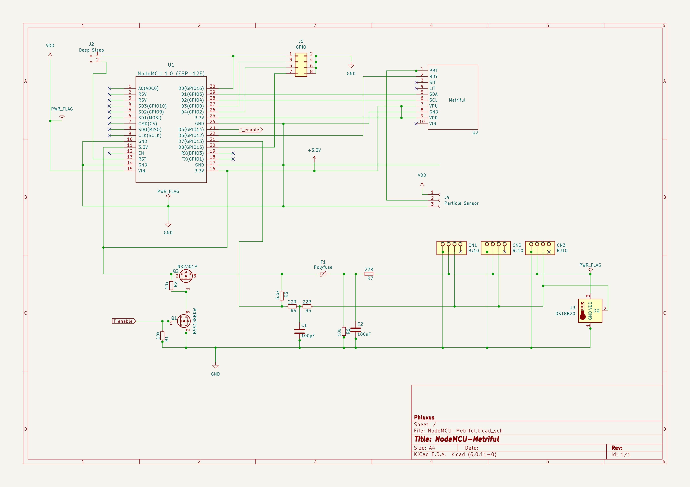

# kicad playground

Just starting with kicad, this is a hodgepodge of small electronics projects, mostly centered around the ESP8266.

## ESP-RS232
A small-footprint design to connect an ESP8266 to a DB9 RS232 interface. Useful to connect to powerbars, power supplies, air quality sensors, solar panel controllers and whatnot.

## ESP-Sensors
A design to test the non-breadboardable ESP8266-12E with various sensors. It has a small prototyping area to solder different sensors on.

## GettingToBlinky
First kicad tutorial by [Contextual Electronics](https://www.youtube.com/watch?v=JN_Y93RTdSo&list=PLy2022BX6Eso532xqrUxDT1u2p4VVsg-q>)

## NodeMCU-Metriful
I wanted to hook up the Kickstarted [Metriful](https://www.kickstarter.com/projects/metriful/sense-indoor-environment-monitor/) project to my mqtt system, so needed to hook it up to the wifi. I decided to use the plethora of NodeMCUs I had laying around and made this dedicated circuit board for it. As a bonus it allows adding a chain of DS18B20 temperature sensors.
I also designed a 3D printable case for it, which you can find [here](https://cad.onshape.com/documents/7fa239791ccb4fa3d67e6539/w/d93b090168ac9bb29c0ad025/e/45795b691b4838ca7b8d4e6e).

## libs
My components

## mods
My footprints

